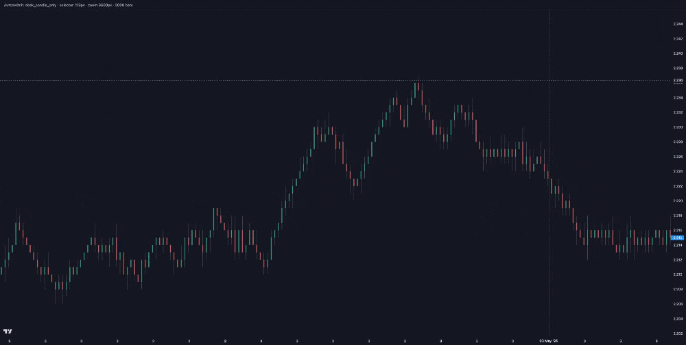

<p align="center">
  
</p>

<h1 align="center">Honeycomb</h1>

<p align="center">
  <strong>Rich, readable footprint-style charts — the kind traders live in — running on the open web.</strong>
</p>

<br>

<h3 align="center">See it in action</h3>

<p align="center">
  <a href="demo/README.md" title="Run the Honeycomb demo locally">
    
  </a>
</p>

<p align="center">
  <sub><em>Zoom in — candles step aside for footprint columns when there is room. Try the <a href="demo/README.md">local demo</a> or <code>autoswitch.html</code>.</em></sub>
</p>

<br>

---

Honeycomb helps you build **order-flow and footprint visuals** on top of [Lightweight Charts](https://github.com/tradingview/lightweight-charts): stacked numbers, volume shapes, heat strips, mini candles, and layouts that **you** define. No subscription required. No “black box” chart you can’t explain to your team or your users.

This project exists because **great tools shouldn’t only live behind a paywall**. We’re here for builders who want something they can **run, change, and ship** — whether you’re prototyping, teaching, or putting a product in production.

---

## What you can do with it

- **Design the chart once, reuse it everywhere** — describe how columns look and behave in a shared config instead of hard-coding every screen.
- **Start simple, add depth when you zoom in** — optional “profiles” can simplify the view when the chart is crowded and bring detail back when there’s room (try the autoswitch demo).
- **Own your roadmap** — open code, open license for the published chart library, so you’re not locked to someone else’s release calendar or pricing.
- **Plug into a chart engine people already trust** — built around Lightweight Charts, not a fork of the universe.

*The nitty-gritty (APIs, file formats, wiring) lives in the docs linked below — you don’t need it to understand why Honeycomb is here.*

---

## Who this is for

- **Developers** building trading, analytics, or education products who want footprint-style visuals without renting a closed platform.
- **Teams** that need to **audit**, **customize**, or **self-host** what they show to customers.
- **Anyone** who believes **open source** makes the market-data tooling ecosystem stronger for everyone.

---

## Getting started (happy path)

You’ll need **[Node.js](https://nodejs.org/)** installed. A few one-time commands from the **`honeycomb`** folder get you a local demo with **synthetic sample data** — no live feed required.

1. **Check and prepare the layout catalog**

   ```bash
   npm run validate:catalog
   npm run compile:layouts
   ```

2. **Create sample candles + footprint data** (saved as `SampleData.json`)

   ```bash
   npm run generate:sample -- \
     --count=300 \
     --seed=42 \
     --startPrice=2.11 \
     --avgVolumePerMin=9000 \
     --startTime=2026-05-01T09:30:00Z \
     --out=./SampleData.json
   ```

3. **Build the chart library**

   ```bash
   npm run core:build
   ```

4. **Launch the demo app**

   ```bash
   npm run demo:dev
   ```

Then open **http://localhost:5190** in your browser. For a second page that shows **automatic layout changes when you zoom**, try **http://localhost:5190/autoswitch.html**.

If a step fails (missing pieces, paths, versions), the **[demo README](demo/README.md)** walks through prerequisites in more detail.

---

## Documentation

| Read this when… |
|-----------------|
| **[demo/README.md](demo/README.md)** — Running the demo, generating data, everyday troubleshooting. |
| **[demo/DEVELOPER.md](demo/DEVELOPER.md)** — Connecting Honeycomb to **your** app: one fixed layout vs switching layouts, sample code patterns. |
| **[CONFIG.md](CONFIG.md)** — Understanding the **layout catalog** (`config.json`): themes, profiles, columns, data naming. |
| **[packages/core/README.md](packages/core/README.md)** — The **npm package** (`@honeycomb/charts`), how to build and test it. |

Start with **demo/DEVELOPER.md** once you want to integrate beyond “see it in the browser.”

---

## Project structure (bird’s-eye view)

- **`demo/`** — Small web app to explore layouts quickly.
- **`packages/core/`** — The chart runtime published as **`@honeycomb/charts`**.
- **`config.json`** — The heart of your layouts (shared across compile + demos).
- **`lib/`**, **`scripts/`**, **`tests/`** — Tools and checks that keep the workspace honest.

You don’t need to memorize this to get value — it’s here so you know where to look when you’re ready.

---

## Contributing

We love **clear issues**, **doc fixes**, and **focused pull requests**. If you’re new:

- Say what you’re trying to achieve in plain language.
- Link or paste **small** examples when something breaks.
- For bigger ideas, open an issue first so we can align before you invest a huge amount of time.

A dedicated **`CONTRIBUTING.md`** may arrive later; until then, treat the **[developer guide](demo/DEVELOPER.md)** and **[config guide](CONFIG.md)** as the best on-ramps.

---

## Security

If you discover a **security vulnerability**, please **don’t** open a public issue with exploit details. Contact the maintainers through a **private channel** appropriate for the platform hosting this repository (e.g. GitHub Security Advisories, if enabled). We’ll work with you on a fix and disclosure timeline.

---

## Code of conduct

We want Honeycomb to be a **welcoming** space. Be respectful, assume good intent, disagree on ideas not people, and help newcomers feel included. Projects like this only thrive when the community feels safe to show up.

---

## License

The **`@honeycomb/charts`** package is released under the **Apache License 2.0** (see **`packages/core/package.json`**). Other material in this repository may use the same or compatible terms — check per-folder **`package.json`** files and file headers when redistributing.

---

## Acknowledgments

Honeycomb stands on the shoulders of **[Lightweight Charts](https://github.com/tradingview/lightweight-charts)** and everyone who contributes to open financial tooling. Thank you for building in public — we’re glad to add another brick to that wall.

---

## A note from the maintainers

We’re passionate about **lowering the barrier** to professional-grade market visuals. If Honeycomb helps you ship, teach, or experiment — **tell someone**, **open a PR**, or **improve a paragraph** in the docs. That’s how free tools stay great.

**You don’t need anyone’s permission to build something excellent. Honeycomb is proof you can start today.**
